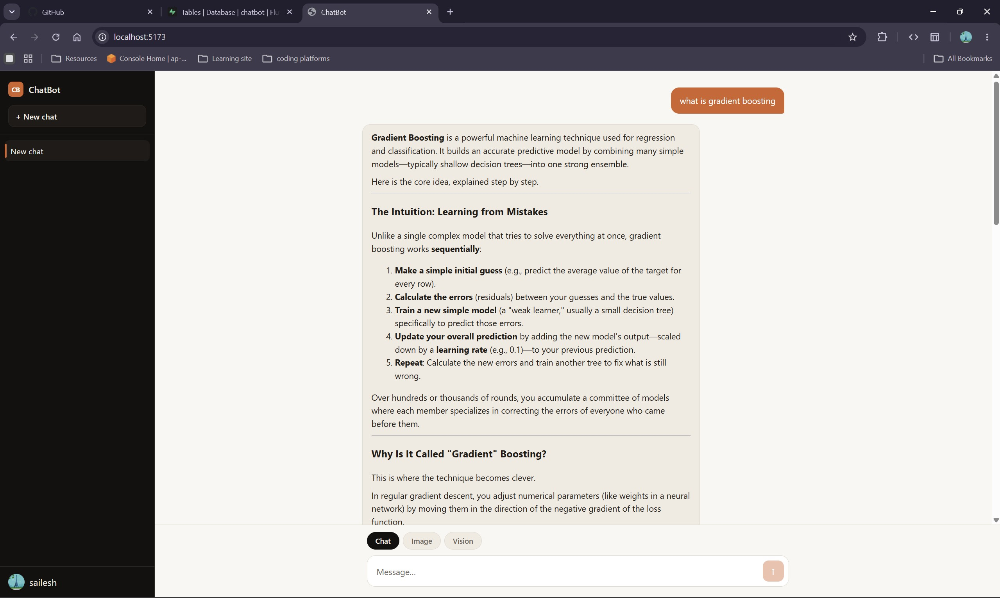
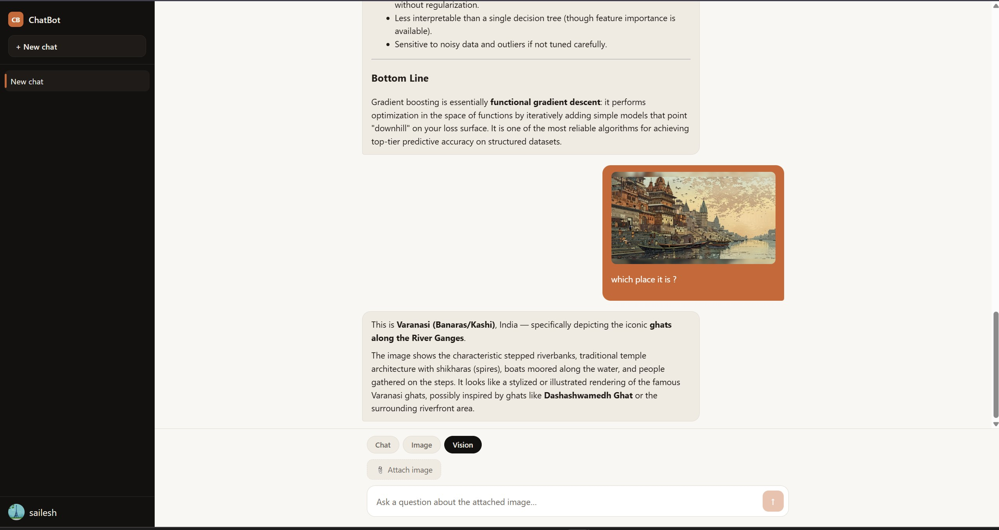
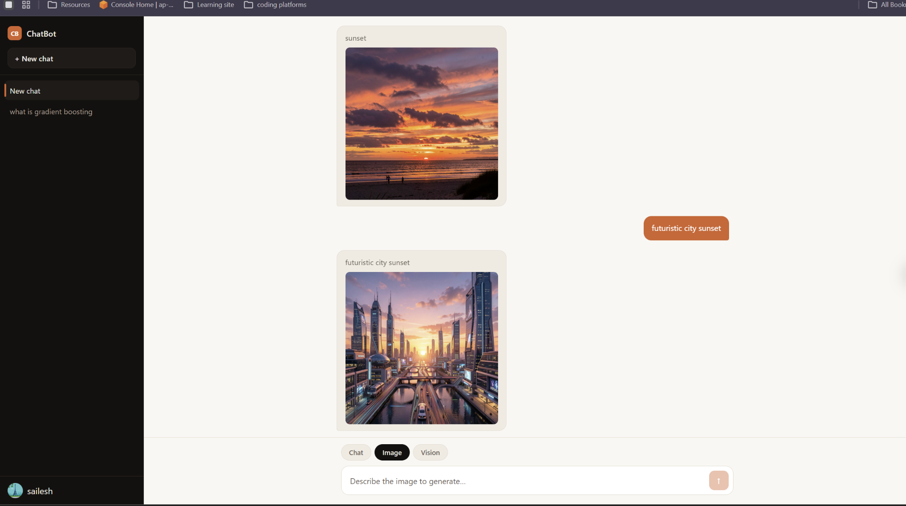
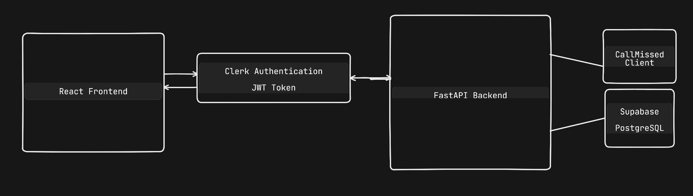

# Chatbot
This project is a full-stack AI chatbot application built with **FastAPI** and **React** that integrates with the **CallMissed API**. It provides three core capabilities:

- AI Chat
- Vision (Image + Question)
- Image Generation

The application also includes user authentication using Clerk and conversation persistence using Supabase (PostgreSQL).

---

# Screenshot

## Chat



---

## Vision



---

## Image Generation 



---

# Features

- AI Chat using **kimi-k2.5**
- Streaming responses using Server-Sent Events (SSE)
- Vision support (image + question)
- Image generation using **flux-2-klein-9b**
- Clerk authentication
- JWT protected backend APIs
- Conversation history stored in Supabase
- Modular FastAPI backend

---

# Tech Stack

## Frontend

- React
- Clerk Authentication

## Backend

- FastAPI
- OpenAI Python SDK

## Database

- Supabase (PostgreSQL)

## AI Models

### Chat + Vision

```
kimi-k2.5
```

### Image Generation

```
flux-2-klein-9b
```

Both models are accessed through the CallMissed API.

---

# Project Structure

```
.
├── Backend
│   ├── db
│   │   ├── database.py
│   │   └── models.py
|   |
|   ├── routes
│   │   ├── chats.py
|   |   ├── text.py
│   │   ├── image.py
│   │   └── vision.py
│   │
│   ├── services
│   │   └── callmissed.py
│   │
|   ├── auth.py
│   ├── main.py
│   └── .env
│
├── frontend
│   ├── src
│   |    ├── components
    |    |     ├── ChatApp.jsx
    |          ├── ChatWindow.jsx
|   |          └── Sidebar.jsx    
│   ├── main.jsx
│   └── App.jsx
│
└── README.md
```

---

# High-Level Architecture





---

# Setup

## 1. Clone the repository

```bash
git clone https://github.com/Fluffy-debuger/Chatbot.git
cd Chatbot
```

---

## 2. Backend

Create a virtual environment

```bash
python -m venv .venv
```

Activate

Windows

```bash
.venv\Scripts\activate
```

Linux / macOS

```bash
source .venv/bin/activate
```

Install dependencies

```bash
pip install -r requirements.txt
```

Create a `.env`

```
CALLMISSED_API_KEY=cm_XXXXXXXX
CALLMISSED_BASE_URL=https://api.callmissed.com/v1

DATABASE_URL=<postgres connection string>

CLERK_JWKS_URL=https://XXXXXXXX/jwks.json
FRONTEND_URL=http://localhost:5173
```

Run backend

```bash
uvicorn main:app --reload
```

---

## 3. Frontend

Install packages

```bash
npm install
```

Create

```
.env
```

```
VITE_BACKEND_URL=http://localhost:8000

VITE_CLERK_PUBLISHABLE_KEY=pk_xxxxxxxxxxxxx
```

Run

```bash
npm run dev
```

---

# API Endpoints

## Chat

```
POST /api/text
```

Request

```json
{
    "prompt":"Explain Gradient Boosting"
}
```

Response

Streaming text (Server Sent Events)

---

## Vision

```
POST /api/vision
```

Content-Type

```
multipart/form-data
```

Parameters

| Field | Type |
|---------|------|
| image | File |
| question | String |

---


---

# CallMissed API

This project uses the CallMissed API.

Documentation:

https://docs.callmissed.com

Create a free API key from the dashboard and place it inside the backend `.env` file.

---

# Error Handling

The backend handles:

- Missing request fields
- Invalid image uploads
- Invalid request formats
- CallMissed API failures
- HTTP 429 (quota exceeded)
- Authentication failures

---


# Trade-offs

To keep the project focused on the assignment requirements:

- FastAPI was used for the backend.
- React was used for the frontend.
- Clerk was used for authentication.
- Supabase was used for conversation persistence.
- Docker and automated tests were not implemented due to time constraints.

---

# Future Improvements

- Request rate limiting
- Conversation search
- Conversation export
- Better markdown rendering
- Image upload progress

---

# AI Usage

AI tools were used for:

- Understanding the CallMissed API documentation
- Reviewing FastAPI implementation
- Debugging integration issues
- Improving documentation

All implementation, testing, debugging, integration, and project structure were completed manually.

---
